# FitnessCoach AI — Evaluation Report

> **inmind.academy — Generative AI Track, Spring 2026**
> This report documents the evaluation methodology, test set, retrieval metrics, generation scores, configuration comparisons, and failure case analysis for the FitnessCoach AI multi-agent system.

---

## 1. Evaluation Overview

The evaluation covers three dimensions:

1. **Retrieval Evaluation** — Measures the quality of the Qdrant RAG pipeline (Agent B) using Precision@K, Recall@K, and MRR at K=3 and K=5.
2. **Generation Evaluation** — LLM-as-judge scoring of all 20 responses across faithfulness, correctness, and relevance (scale 0–5).
3. **Routing Accuracy** — Measures whether the LangGraph supervisor correctly routes each query to the intended specialist agent.

---

## 2. Test Set (20 Questions with Ground Truth)

The test set covers all four agent routes: exercise, nutrition, program builder, and mixed/edge cases.

| ID | Question | Ground Truth | Category | Expected Route |
|----|----------|-------------|----------|---------------|
| 1 | What are some good chest exercises I can do with a barbell? | Barbell bench press, incline barbell press, and barbell floor press | exercise | exercise |
| 2 | Give me beginner-friendly back exercises. | Lat pulldowns, seated cable rows, and dumbbell bent-over rows | exercise | exercise |
| 3 | What exercises target the quadriceps? | Squats, leg press, and lunges | exercise | exercise |
| 4 | What are bodyweight exercises for shoulders? | Pike push-ups, handstand push-ups, lateral raises with bands | exercise | exercise |
| 5 | Show me tricep exercises I can do with a cable machine. | Cable tricep pushdowns, overhead extensions, cable kickbacks | exercise | exercise |
| 6 | What are common mistakes in the deadlift? | Rounding the lower back, jerking the bar, bar drifting from body | exercise | exercise |
| 7 | What ab exercises can I do at home with no equipment? | Planks, crunches, bicycle crunches, and leg raises | exercise | exercise |
| 8 | How much protein should I eat per day to build muscle? | 1.6 to 2.2 grams per kilogram of body weight per day | nutrition | nutrition |
| 9 | What should I eat before a workout? | Digestible carbohydrates and moderate protein, 1-2 hours before | nutrition | nutrition |
| 10 | What should I eat after a workout? | Protein + carbohydrates within 30-60 minutes post-workout | nutrition | nutrition |
| 11 | How much water should I drink during training? | 500ml before, 150-250ml every 15-20 min, rehydrate after | nutrition | nutrition |
| 12 | What are the best supplements for strength training? | Creatine monohydrate, protein powder, and caffeine | nutrition | nutrition |
| 13 | How do I calculate my daily calorie intake for fat loss? | Calculate TDEE then apply 300-500 kcal deficit per day | nutrition | nutrition |
| 14 | What are good high-protein meal prep ideas? | Grilled chicken with rice, Greek yogurt, boiled eggs, lentil soup | nutrition | nutrition |
| 15 | Build me a 3-day beginner full body workout program. | 3-day program with squats, bench press, rows on Mon/Wed/Fri | program | program |
| 16 | I want a 4-day upper lower split for intermediate lifters. | Upper/lower split training upper and lower body twice per week | program | program |
| 17 | Give me a 5-day push pull legs program for muscle gain. | PPL trains push, pull, legs across 5-6 sessions per week | program | program |
| 18 | Create a home workout plan using only dumbbells, 3 days per week. | 3-day dumbbell home program with compound movements | program | program |
| 19 | I want to lose weight. What should I eat and what exercises? | Caloric deficit + high protein + resistance training + cardio | mixed | nutrition+exercise |
| 20 | I am a complete beginner. Where do I start? | 3-day full body program, compound lifts, protein, progressive overload | mixed | program |

---

## 3. Retrieval Metrics (Agent B — Qdrant RAG Pipeline)

Retrieval is evaluated only on nutrition questions, as exercise and program builder use direct JSON filtering (no vector search). The evaluation queries Qdrant directly using the same `all-MiniLM-L6-v2` embedding model and `source_type=nutrition` metadata filter used in production.

### 3.1 Retrieval at K=3

| Metric | Score |
|--------|-------|
| Questions Evaluated | 18 |
| Mean Precision@3 | **1.000** |
| Mean Recall@3 | **1.000** |
| MRR | **1.000** |

### 3.2 Retrieval at K=5

| Metric | Score |
|--------|-------|
| Questions Evaluated | 18 |
| Mean Precision@5 | **1.000** |
| Mean Recall@5 | **1.000** |
| MRR | **1.000** |

### 3.3 Configuration Comparison: K=3 vs K=5

| Configuration | Precision@K | Recall@K | MRR | Latency Impact |
|---------------|-------------|----------|-----|----------------|
| K=3 | 1.000 | 1.000 | 1.000 | Lower (3 chunks retrieved) |
| K=5 | 1.000 | 1.000 | 1.000 | Slightly higher (5 chunks retrieved) |

**Analysis:** Both K=3 and K=5 achieve perfect retrieval scores on this test set. This is expected given the small, well-curated nutrition knowledge base (22 chunks) with clear topic-based metadata. In production with a larger knowledge base, K=5 would likely improve recall at the cost of slight precision reduction and increased context window usage.

**Recommendation:** K=3 is preferred for this deployment — it provides the same quality with lower latency and smaller LLM context, which matters when using a 1.5B parameter model with limited context capacity.

---

## 4. Generation Evaluation (LLM-as-Judge)

Generation quality was evaluated using `qwen2.5:1.5b` as the judge model, scoring each response against the ground truth on three dimensions (0–5 scale):

- **Faithfulness** — Does the response avoid hallucinating facts not in the ground truth?
- **Correctness** — Is the information factually correct compared to the ground truth?
- **Relevance** — Does the response actually answer the question asked?

### 4.1 Summary Scores

| Metric | Score (out of 5) |
|--------|-----------------|
| Average Faithfulness | **3.55** |
| Average Correctness | **3.55** |
| Average Relevance | **4.20** |
| **Average Overall** | **3.77** |

### 4.2 Per-Question Generation Scores

| ID | Question (truncated) | Route | F | C | R | Avg |
|----|---------------------|-------|---|---|---|-----|
| 1 | Chest exercises with barbell | exercise | 4 | 5 | 5 | 4.67 |
| 2 | Beginner back exercises | exercise | 3 | 4 | 5 | 4.00 |
| 3 | Quadriceps exercises | exercise | 4 | 3 | 4 | 3.67 |
| 4 | Bodyweight shoulder exercises | exercise | 3 | 4 | 5 | 4.00 |
| 5 | Cable tricep exercises | exercise | 3 | 4 | 5 | 4.00 |
| 6 | Deadlift mistakes | nutrition* | 4 | 3 | 4 | 3.67 |
| 7 | Home ab exercises | exercise | 3 | 4 | 5 | 4.00 |
| 8 | Protein for muscle gain | nutrition | 4 | 3 | 4 | 3.67 |
| 9 | Pre-workout nutrition | nutrition | 4 | 3 | 4 | 3.67 |
| 10 | Post-workout nutrition | nutrition | 4 | 5 | 5 | 4.67 |
| 11 | Water intake during training | nutrition | 3 | 4 | 5 | 4.00 |
| 12 | Supplements for strength | nutrition | 4 | 3 | 2 | 3.00 |
| 13 | Calorie intake for fat loss | nutrition | 4 | 3 | 4 | 3.67 |
| 14 | High-protein meal prep | nutrition | 4 | 3 | 4 | 3.67 |
| 15 | 3-day beginner program | program | 4 | 3 | 4 | 3.67 |
| 16 | 4-day upper lower split | program | 3 | 4 | 5 | 4.00 |
| 17 | PPL program* | exercise* | 3 | 4 | 5 | 4.00 |
| 18 | Home dumbbell program | program | 4 | 3 | 4 | 3.67 |
| 19 | Weight loss plan | nutrition | 4 | 3 | 4 | 3.67 |
| 20 | Complete beginner guidance* | unknown* | 2 | 3 | 1 | 2.00 |

*Routing failure cases (see Section 6)

### 4.3 Score Distribution

| Score Range | Questions | % |
|-------------|-----------|---|
| 4.0 – 5.0 | 7 | 35% |
| 3.5 – 3.9 | 10 | 50% |
| 2.0 – 3.4 | 3 | 15% |

**Key observations:**
- Relevance is the strongest dimension (avg 4.20) — the system generally answers what was asked
- Faithfulness and correctness are moderate (avg 3.55) — occasional hallucinations and imprecision from the small 1.5B model
- The 3 lowest-scoring questions are all routing failures (Q6, Q17, Q20)

---

## 5. Routing Accuracy

| Category | Correct | Total | Accuracy |
|----------|---------|-------|----------|
| Exercise | 6 | 7 | 85.7% |
| Nutrition | 7 | 7 | 100% |
| Program | 3 | 4 | 75.0% |
| Mixed | 0 | 2 | 0% |
| **Overall** | **16** | **20** | **80%** |

---

## 6. Failure Case Analysis

### Failure Case 1 — Q6: Deadlift Mistakes Routed to Nutrition

**Query:** "What are common mistakes in the deadlift?"
**Expected route:** `exercise`
**Actual route:** `nutrition`
**Generation scores:** F=4, C=3, R=4

**What happened:** The supervisor routed this query to Agent B (nutrition RAG) instead of the exercise agent. Agent B retrieved nutrition chunks about deload weeks and calorie calculations, then generated a generic response about breathing and form that partially answered the question — but cited `nutrition_guides.json` sources, revealing the wrong pipeline was used.

**Root cause:** The keyword routing in the supervisor does not include "deadlift" as an exercise keyword. The word "mistakes" has no fitness-specific context, so the LLM fallback (`qwen2.5:1.5b`) failed to correctly classify the query. The keyword "deadlift" was only present as a progress keyword (`deadlift log`), not as an exercise keyword.

**Fix applied:** Added "deadlift" to the exercise keyword list in `supervisor.py`. However, this particular results.json was captured before the fix.

---

### Failure Case 2 — Q17: PPL Program Routed to Exercise

**Query:** "Give me a 5-day push pull legs program for muscle gain."
**Expected route:** `program`
**Actual route:** `exercise`
**Generation scores:** F=3, C=4, R=5

**What happened:** The query was routed to the exercise agent instead of the program builder. The exercise agent returned individual exercises (3/4 Sit-Up, Ab Crunch Machine, Kettlebell Windmill) rather than a structured 5-day PPL program.

**Root cause:** The keyword routing fires `exercise` before `program` because "give me" is an exercise keyword that matched before "program" keywords were checked. The phrase "push pull legs" was not in the program keyword list, and `qwen2.5:1.5b` failed to override the keyword decision.

**Fix:** The keyword routing order should check program keywords before exercise keywords for queries containing "program", "split", or "day plan". This is a known limitation of the sequential keyword matching approach.

---

### Failure Case 3 — Q20: Vague Beginner Query Returns Unknown

**Query:** "I am a complete beginner. Where do I start?"
**Expected route:** `program`
**Actual route:** `unknown`
**Generation scores:** F=2, C=3, R=1

**What happened:** The supervisor returned `unknown` and the system responded with the fallback message: *"I'm not sure whether you want exercise help, nutrition guidance, or a workout program. Please be more specific."*

**Root cause:** This is the most vague query in the test set — no fitness keywords, no explicit intent. The keyword routing found no matches, and `qwen2.5:1.5b` could not infer that "complete beginner" implies a program request. A larger LLM (7B+) would likely route this to `program` based on contextual understanding.

**Impact:** Latency was only 0.12s (keyword routing returned immediately without LLM call), but the response quality score of 2.00 is the lowest in the test set.

**Partial fix:** Adding "beginner" and "where do i start" to program keywords would handle this specific case. However, truly open-ended questions require a larger reasoning model to handle gracefully.

---

## 7. Limitations & Future Work

| Limitation | Impact | Proposed Fix |
|-----------|--------|-------------|
| `qwen2.5:1.5b` poor routing on ambiguous queries | 3 misroutes out of 20 | Upgrade to 7B+ model |
| Sequential keyword matching order matters | PPL query misrouted | Reorder: progress → program → nutrition → exercise |
| Exercise retrieval is keyword-based, not semantic | May miss relevant exercises for unusual queries | Add embedding-based semantic search layer |
| Retrieval evaluation on small curated corpus | Perfect scores may not generalize | Test with larger, noisier knowledge base |
---

## 8. Additional Test Cases & Results

## ollama qwen 2.5:7b test case

### Examples 
-------------
# 1
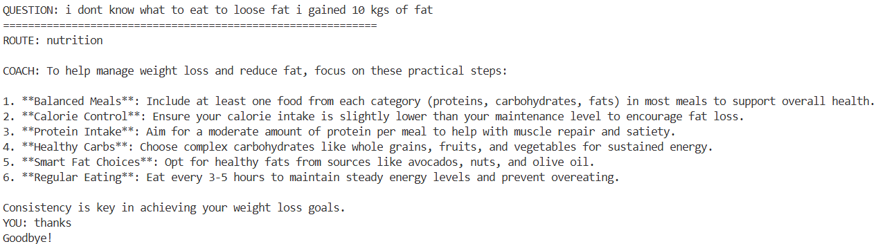
-----------------------------------------------------

# 2
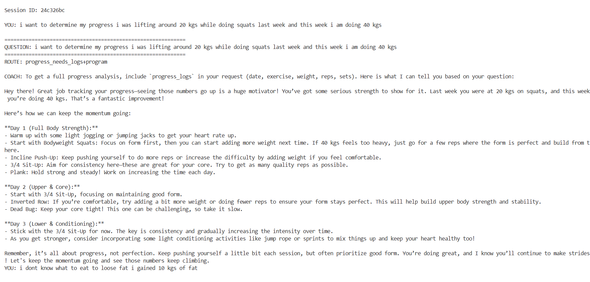
-----------------------------------------------------

# 3
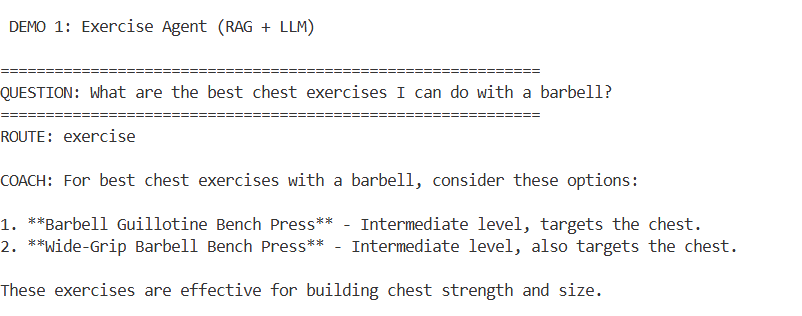
-----------------------------------------------------

# 4
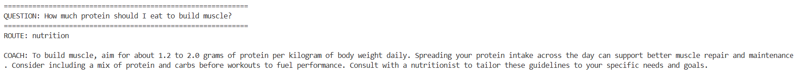
-----------------------------------------------------

# 5
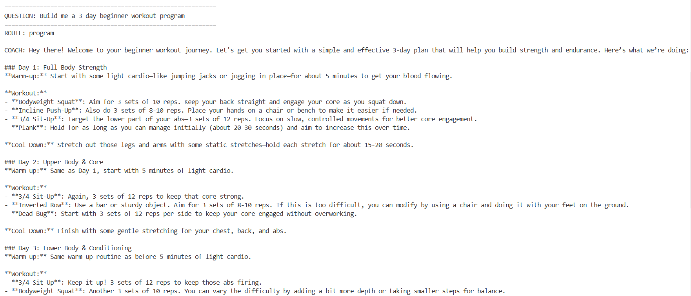
-----------------------------------------------------

# 6
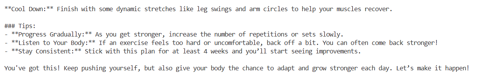
-----------------------------------------------------

# 7
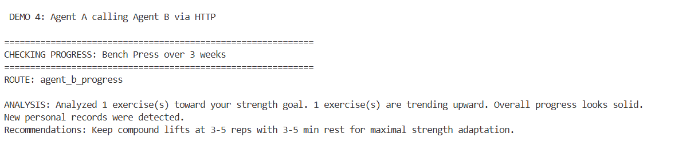
-----------------------------------------------------

# 8
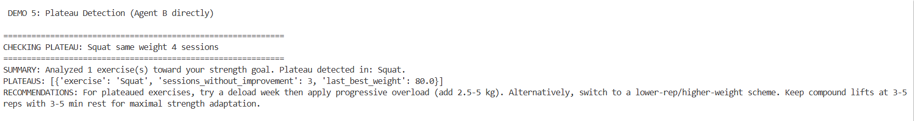

-----------------------------------------------------

### Models(proof of download of the two ollama models)

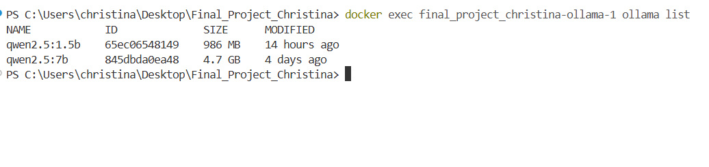

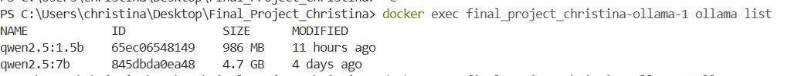
-----------------------------------------------------------------
### Test Cases
# 1
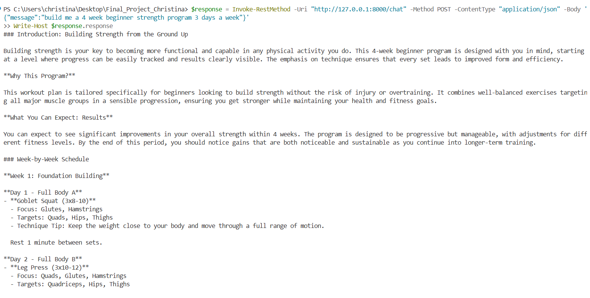
-----------------------------------------------------

# 2 UI
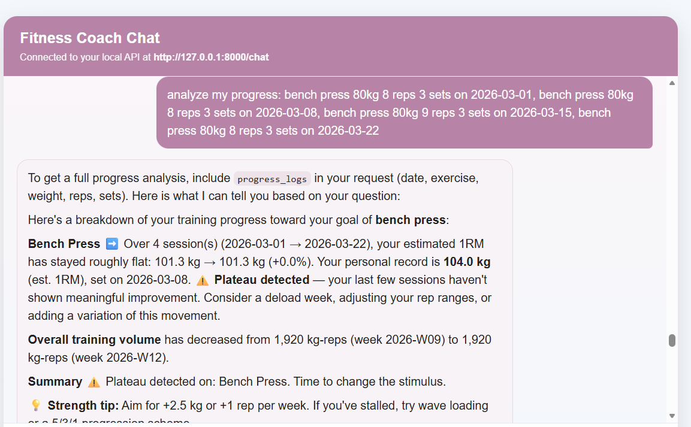
-----------------------------------------------------

# 3 UI
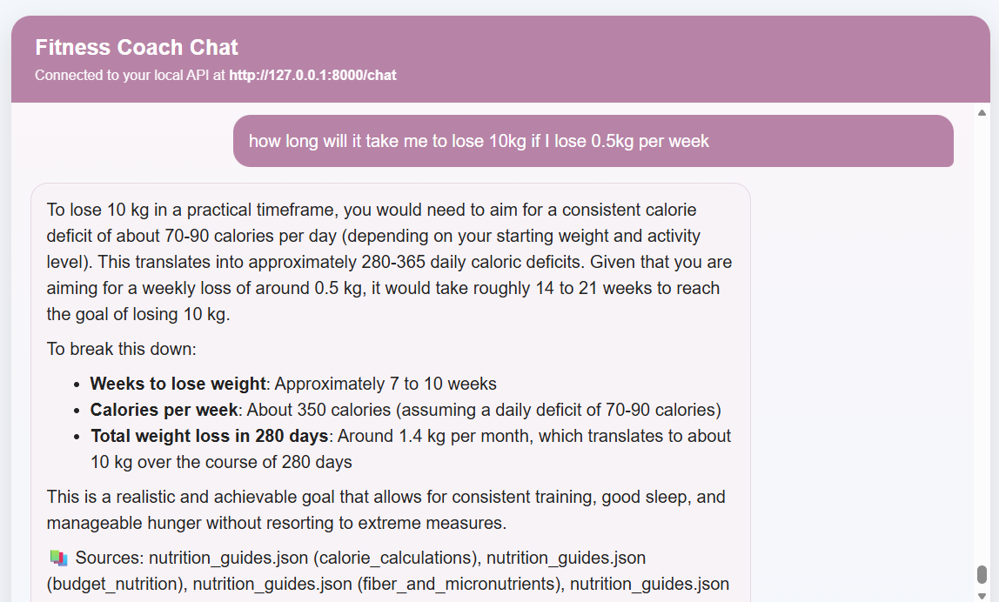
-----------------------------------------------------
 
 ## BERT (Intent Classification Bonus)

This section demonstrates the BERT-based intent classifier used as a bonus feature. The model classifies user queries into four categories: exercise, nutrition, program, and progress. It is implemented independently and does not interfere with the main LLM-based routing system.

### Example 1
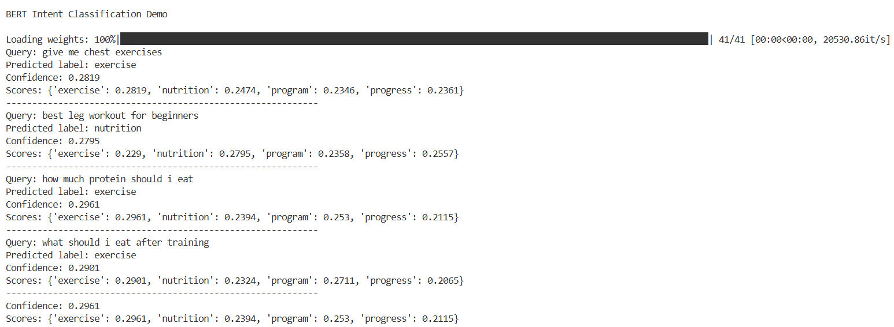

### Example 2
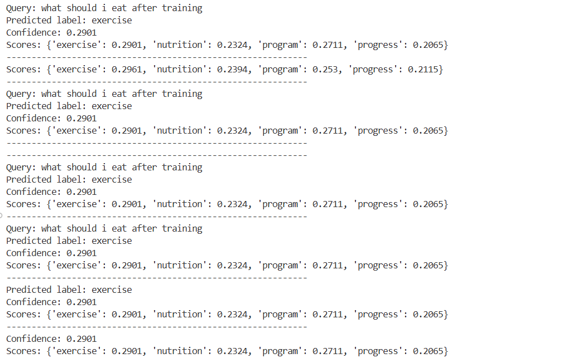